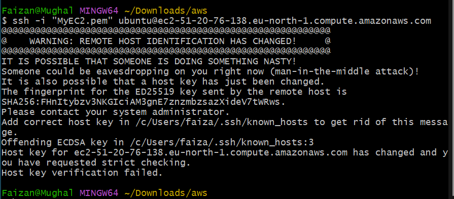
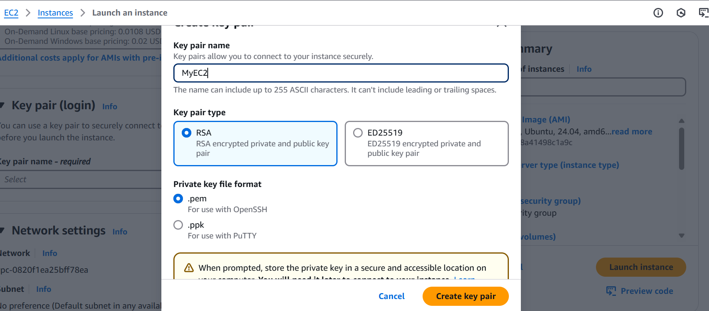
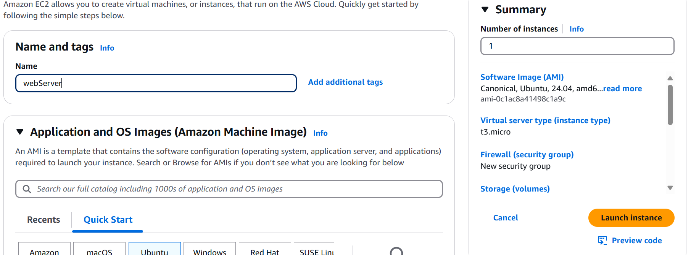
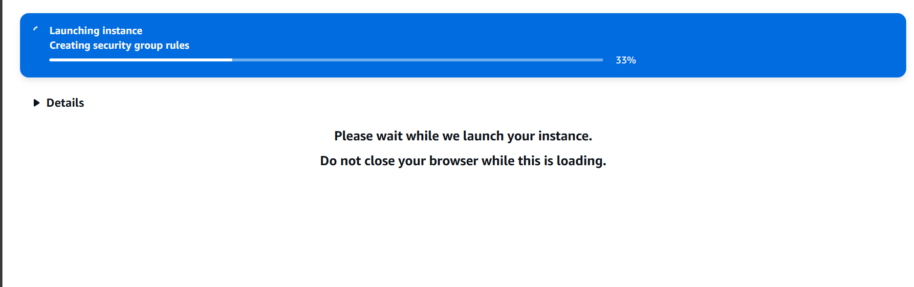
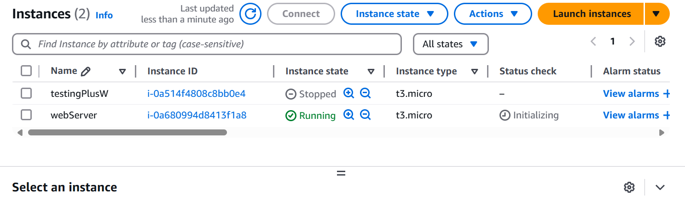
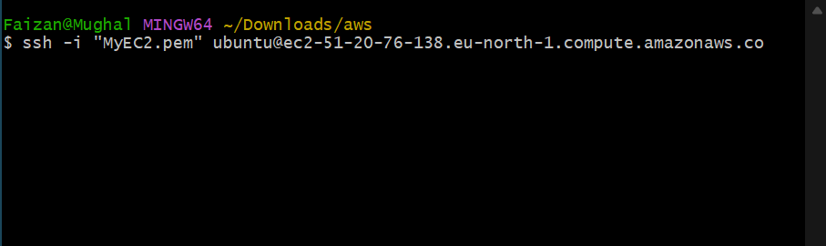

## **Steps Per formed**
### EC2 Instance Creation
- Launched Ubuntu 22.04 LTS instance (Free Tier eligible)
- Selected t2.micro instance type
- Configured security groups to allow SSH (port 22) from my IP
- Created and downloaded new key pair (`MyEC2.pem`)

